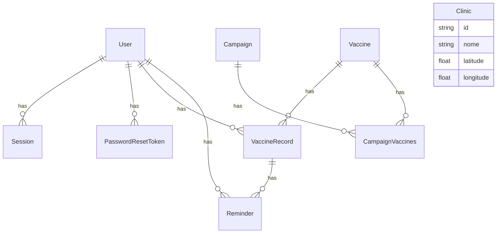

# ERD — e-imune (S0)

Documentação completa: [docs/banco-de-dados.md](../docs/banco-de-dados.md).

Decisão de migração: **RESET + RESEED**. Sem dado de produção. Tabelas legadas `paciente`, `vacina` e `aplicacao` foram substituídas.

`Clinic` não tem FK para `Vaccine`. `Reminder.vaccine_record_id` é opcional.

## Tabelas

| Modelo | Tabela | Dono de consumo |
|---|---|---|
| User | `user` | Aylon |
| Session | `session` | Aylon |
| PasswordResetToken | `password_reset_token` | Aylon |
| Vaccine | `vaccine` | Gustavo |
| VaccineRecord | `vaccine_record` | Gustavo |
| Reminder | `reminder` | Gustavo |
| Campaign | `campaign` | Gustavo |
| CampaignVaccines | `campaign_vaccines` | Gustavo |
| Clinic | `clinic` | Gustavo |
